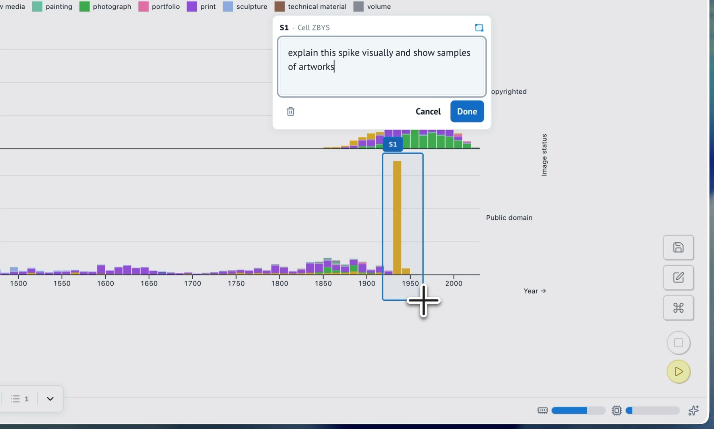

<p align="center">
  <a href="https://marimo-team.github.io/marimo-lens/">
    <picture>
      <source media="(prefers-color-scheme: dark)" srcset="https://marimo-team.github.io/marimo-lens/brand/marimo-lens-lockup-horizontal-dark.svg">
      
    </picture>
  </a>
</p>

<p align="center">
  <a href="https://pypi.org/project/marimo-lens/"></a>
  <a href="https://spdx.org/licenses/Apache-2.0.html"></a>
</p>

**Let your notebook agent see what you see.**

Point to part of a rendered [marimo](https://marimo.io/) result and say what should change. Lens
connects that selection to the cells and notebook context behind the result, so
an agent can inspect the right code and return its work for review.

## Demo

Mark a chart region, hand it to a notebook agent, and review the result it
brings back into view.

<p align="center">
  <a href="https://marimo-team.github.io/marimo-lens/#see-lens-in-action">
    
  </a>
</p>

<p align="center">
  <a href="https://marimo-team.github.io/marimo-lens/#see-lens-in-action"><strong>Watch the 25-second demo</strong></a>
</p>

## Quick start

Open a local notebook with Lens available:

```sh
uvx --with marimo-lens marimo edit notebook.py
```

Mount Lens in one notebook cell:

```python
from marimo_lens import Lens

lens = Lens()
lens
```

Keep that cell mounted. Press **Select**, click a point or drag a region inside
a rendered output, then add an optional note for the agent.

Lens supports Python 3.10 through 3.14 and marimo 0.24.0 or newer.

## Connect an agent

Lens works with agents that can execute code in the live marimo kernel. The
Python package carries the matching Agent Skill and registers its code-mode
capability with marimo.

The [agent guide](https://marimo-team.github.io/marimo-lens/agents) covers
compatible agent environments, the optional marimo Pair connection, selection
context, verification, reveal, and resolution.

## Documentation

- [Getting started](https://marimo-team.github.io/marimo-lens/getting-started) creates the first selection.
- [What is Lens?](https://marimo-team.github.io/marimo-lens/overview) introduces the product model and routes to deeper concepts.
- [Selections](https://marimo-team.github.io/marimo-lens/selections) and [Connect an agent](https://marimo-team.github.io/marimo-lens/agents) cover the two sides of the workflow.
- [Python API](https://marimo-team.github.io/marimo-lens/api) and [Troubleshooting](https://marimo-team.github.io/marimo-lens/troubleshooting) provide exact lookup and recovery.

## Development

The [example notebook](examples/lens.py) provides a local product smoke test.
Read [Contributing](CONTRIBUTING.md) for setup, verification, and pull request
guidance. The [development documentation](development_docs/README.md) covers
architecture, browser validation, packaging, and release.

Report bugs through [GitHub Issues](https://github.com/marimo-team/marimo-lens/issues).
Report security vulnerabilities through the [security policy](SECURITY.md).
marimo-lens is available under the [Apache License 2.0](LICENSE).

## Acknowledgements

marimo-lens was inspired by
[Agentation](https://github.com/benjitaylor/agentation).
