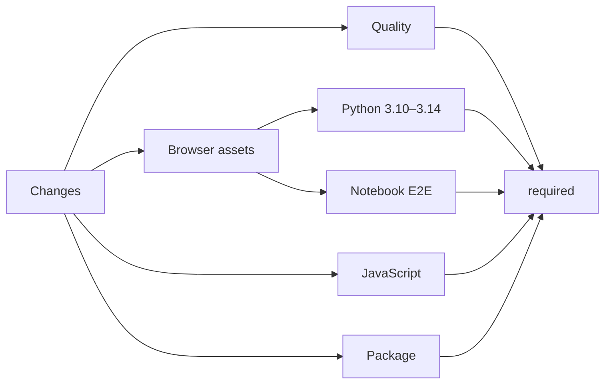

# Testing

Test Lens through the boundary a consumer depends on. State transitions belong
in state tests, wire shapes in both protocol suites, browser behavior in widget
tests, pixels and layout in a real browser, and distribution contents in package
verification.

## Evidence layers

| Layer              | Proves                                                                                              | Primary command or suite                               |
| ------------------ | --------------------------------------------------------------------------------------------------- | ------------------------------------------------------ |
| Protocol           | Python and TypeScript accept the same bounded messages and reject malformed data.                   | Protocol package tests and `test_protocol.py`          |
| Selection state    | Revisions, atomic transitions, images, History, limits, and failure behavior.                       | `test_selection_state.py`                              |
| Context            | Runtime projection, provenance, controls, references, text, and context types.                      | Context, runtime, control, and provenance Python tests |
| Image capture      | DOM raster geometry, composition, PNG bounds, owner realms, iframe behavior, and patch obligations. | Image-capture package tests                            |
| Widget             | Gestures, reducers, commands, target resolution, attention, focus, and view ownership.              | Widget package tests                                   |
| Public Python      | `Lens`, `MountedLens`, errors, argument validation, close, and agent connection.                    | Widget and agent Python tests                          |
| Bundle integration | Generated browser resources load through AnyWidget and agent-created output.                        | `test_bundle_integration.py`                           |
| Documentation      | Interactive cells compile, routes and assets build, and base paths remain valid.                    | `make docs` and Pages workflow checks                  |
| Distribution       | Wheel, source distribution, rebuilt wheel, metadata, resources, entry point, and installed API.     | `make package`                                         |
| Real browser       | Notebook gestures, image capture, feedback, History, theme, and narrow layouts in Chromium.         | `pnpm test:e2e` and browser inspection                 |

One passing layer does not substitute for another. jsdom can prove a DOM
algorithm while still missing a browser raster or layout failure.

## Focused TypeScript checks

Run check, test, and build commands in the package that owns the change:

```sh
pnpm --filter @marimo-lens/protocol check
pnpm --filter @marimo-lens/protocol test
pnpm --filter @marimo-lens/protocol build

pnpm --filter @marimo-lens/image-capture check
pnpm --filter @marimo-lens/image-capture test
pnpm --filter @marimo-lens/image-capture build

pnpm --filter @marimo-lens/widget check
pnpm --filter @marimo-lens/widget test
pnpm --filter @marimo-lens/widget build
```

Protocol changes usually require all three packages because image capture and
the widget consume its source contracts.

## Unused code and dependencies

Run [Knip](https://knip.dev/), the JavaScript and TypeScript unused-code checker,
across the workspace:

```sh
pnpm knip
```

The check reports unused files, exports, types, dependencies, and catalog entries,
plus unlisted dependencies and unresolved imports. Findings and stale configuration
hints fail the command. `pnpm check` runs it as part of the local and CI gates.
Manifest-declared package entry exports remain API contracts. Knip checks internal
module exports for consumers across the workspace.

`knip.jsonc` records dependencies consumed through the Python bundle task and
generated VitePress pages. Knip discovers package exports, tests, build scripts,
and the lint plugin from manifests and tool configuration. Keep exceptions beside
the workspace that needs them and document the consuming boundary.

## Focused Python checks

Build the bundled browser resources before Python tests:

```sh
pnpm --filter @marimo-lens/python build
uv run pytest -q
```

Use a direct test path while iterating:

```sh
uv run pytest -q packages/marimo-lens/tests/test_selection_state.py
uv run pytest -q packages/marimo-lens/tests/test_context_builder.py
uv run pytest -q packages/marimo-lens/tests/test_agent.py
uv run pytest -q packages/marimo-lens/tests/test_bundle_integration.py
```

Python formatting and type checks are:

```sh
uv run ruff format --check
uv run ruff check
uv run ty check
uv run pyrefly check --min-severity warn
```

## Contract-to-test map

| Change                                                   | Required evidence                                                                         |
| -------------------------------------------------------- | ----------------------------------------------------------------------------------------- |
| Target, anchor, selection, History entry, or event field | TypeScript protocol test, Python protocol test, owning state or widget test               |
| Revision or state mutation                               | Selection-state test and browser mutation test                                            |
| Image metadata or byte rule                              | Protocol tests, Python image test, image-capture test                                     |
| Selection capture lifecycle                              | Widget capture/action test, Python selection-state test, real browser capture             |
| Cell-output capture                                      | Python output-slot test, browser transport test, bundle integration, real browser capture |
| marimo graph or control access                           | Runtime, control, provenance, and context tests across missing and failing host values    |
| DOM target resolution                                    | Target and document-interaction tests plus real browser host scenario                     |
| Iframe, shadow-root, or owner-realm behavior             | Patch and image tests plus real browser scenario                                          |
| Activity, reveal, or resolution receipt                  | Python public API test, protocol test, target-attention test, browser sequencing check    |
| Agent discovery or mount                                 | Agent test, bundle integration, package verification                                      |
| Browser bundle or Hatch config                           | Bundle integration and `make package`                                                     |
| Agent Plugin resource                                    | Skill tests, package verification, and rebuilt wheel                                      |
| Public documentation example                             | Docs build and rendered browser verification                                              |

## Test design

- Assert supported behavior through the nearest public API, transport envelope,
  synchronized trait, image bytes, browser state, file artifact, or installed
  distribution.
- Keep one test focused on one contract.
- Use concrete expected values instead of mirroring a production constant as
  the sole assertion.
- Test a helper directly when it owns nontrivial behavior or forms a package
  contract.
- Treat fixture shape as setup unless the shape is the behavior under test.
- Keep test comments for host quirks, artificial timing, lifecycle ordering,
  security boundaries, and compatibility constraints.
- Verify spacing, color, alignment, scrolling, responsive layout, and pixels in
  a browser.

## JavaScript runtime boundary

The widget and image-capture suites use
[jsdom](https://github.com/jsdom/jsdom). The test setup supplies browser
objects and deterministic geometry needed to exercise reducers, message clients,
and DOM algorithms.

jsdom does not provide browser layout, native canvas pixels, real scrolling,
cross-document process boundaries, font loading, pointer hit testing, or actual
network and cross-origin behavior. Keep faithful unit seams, then validate the
observable result in a browser.

## Real-browser evidence

Run the [Playwright](https://playwright.dev/) end-to-end suite against a live
marimo notebook after changing interaction, capture, attention, styles, or host
integration:

```sh
pnpm --filter @marimo-lens/e2e install-browser
pnpm --filter @marimo-lens/python build
pnpm test:e2e
```

`apps/e2e/` owns the test runner and fixture notebook. The runner starts local
marimo run and edit servers. Editor tests copy the fixture into their artifact
directory so each test owns a separate kernel. Four Chromium projects test desktop and narrow
layouts in light and dark themes. An editor project verifies selection, notes,
producing cells, and PNG capture through `marimo edit`. The editor uses
`apps/e2e/.marimo.toml` to disable code completion and language servers.
The console guard records marimo 0.24's disabled-Copilot initialization timeout
in a diagnostic attachment. All other console errors and all uncaught page errors
fail the test.
It retains traces and screenshots for failures in
`apps/e2e/test-results/` and an HTML report in `apps/e2e/playwright-report/`.
Run `pnpm --filter @marimo-lens/e2e test:e2e:ui` for interactive debugging.

`robustness.spec.ts` runs in both notebook and editor mode. It covers rejected
agent revisions, atomic invalid resolutions, failed and interrupted PNG capture,
output replacement, cancelled gestures, duplicate views, remounts, and selection
capacity. `sessions.spec.ts` checks isolation between independent run-mode kernels. Capture tests hold the browser encoder to
control races, then release it and verify kernel selections and image bytes.

`performance.spec.ts` runs in desktop Chromium. It compares 90 streaming updates
on zero-row and 1,000-row notebooks with the same twelve annotations in the same
browser session. Each size is measured with annotations visible, while picking
a target, and while the annotated output is unavailable. A Lens-hidden run
supplies the frame-cadence baseline. A second test creates, previews, and
deletes sixteen annotations, checking PNG URL release and browser resources after
garbage collection.

| Measurement                                                    | Regression budget                                                          |
| -------------------------------------------------------------- | -------------------------------------------------------------------------- |
| Script-time growth from zero to 1,000 rows                     | Under 750 ms over 90 updates relative to the matching small-notebook state |
| 95th-percentile frame gap                                      | Under 50 ms or twice the baseline, whichever is greater                    |
| Largest frame gap                                              | Under 250 ms or twice the baseline, whichever is greater                   |
| Combined browser response for arming, selection, and note save | Under 2.5 s                                                                |
| Kernel context and standalone text                             | Under 250 ms                                                               |
| Retained heap growth after warmup                              | Under 8 MiB                                                                |
| Retained DOM nodes and event listeners                         | Fewer than 500 additional nodes and 100 listeners                          |
| Preview PNG URLs after deletion                                | Zero                                                                       |
| Average duration of the final four churn cycles                | Under 1.75 times the warmup average plus 250 ms                            |

Annotation latency uses browser event timestamps: selection-mode click to armed
controls, pointer release to the focused note field, and Done click to the saved
note dialog closing. Their sum excludes driver round trips, mouse interpolation,
and assertion polling. All three ready states must be observed.

These budgets detect regressions in the fixture workloads. Timings depend on the
browser, hardware, and runner load. Performance measurements are attached as JSON
to the HTML report and the machine-readable `test-results/results.json` report.

Run the focused suites with:

```sh
pnpm --filter @marimo-lens/e2e test:e2e robustness.spec.ts performance.spec.ts --project=light
pnpm --filter @marimo-lens/e2e test:e2e robustness.spec.ts --project=editor
```

Inspect documentation and browser behavior beyond those scenarios separately.

Use at least these scenarios for the affected surface:

1. Default notebook output target.
2. Point selection and dragged rectangle.
3. Note edit, current-selection change, delete, resolve, and reopen.
4. Selection image preview and image replacement after anchor movement.
5. Activity followed by reveal and final resolution receipt.
6. Target temporarily removed and restored.
7. Large or scrolled output capture.
8. Same-origin iframe content when iframe behavior changed.
9. Open shadow-root content when host traversal changed.
10. Multiple Lens views in one document and independent views in separate
    documents when ownership changed.
11. Desktop and narrow viewport.
12. Keyboard access, focus restoration, announcements, and reduced motion.

Inspect the browser console and page overflow. Capture screenshots when the
change affects visible presentation or documentation.

## Repository gate

Run:

```sh
make check
```

The gate runs, in order:

1. `uv lock --check`
2. `pnpm check`
3. `pnpm test`
4. `pnpm build`
5. Ruff format and lint checks
6. ty
7. Pyrefly
8. Python tests
9. `pnpm test:e2e`
10. `shellcheck scripts/*.sh`
11. `git diff --check`

Install the Playwright Chromium browser before the first gate run. Run
`make package` after bundling, packaging, manifest, Agent Plugin, or release
changes.

## CI matrix

The CI workflow classifies changed paths before starting contract jobs.
`.github/filters.yml` owns the classification. JavaScript jobs share the pinned
Node.js and frozen pnpm setup in `.github/actions/setup-js/action.yml`.



- **Quality** checks JavaScript and Python formatting, linting, types, unused
  JavaScript and TypeScript code and dependencies, shell scripts, lock consistency,
  and whitespace.
- **Browser assets** builds the Python widget resources once and uploads them
  as the `browser-assets` artifact. The Python matrix and Notebook E2E jobs
  consume that artifact.
- **Python** tests the public package on Python 3.10 through 3.14 on Linux and
  Python 3.12 on Windows.
- **JavaScript** tests and builds the protocol, image-capture, and widget packages
  on Linux and Windows.
- **Notebook E2E** installs Chromium and runs `pnpm test:e2e` on Linux and
  Windows. The editor fixture runs its cells independently of personal marimo
  startup settings. Reports and failure evidence are uploaded as
  `notebook-e2e-<runner OS>`.
- **Package** builds and validates distribution artifacts through `make package`.

`.github/actions/setup-browser/action.yml` restores Chromium's headless shell
from a cache keyed by operating system, architecture, and installed Playwright
version. A cache miss installs and saves the browser before tests run. Linux
system libraries are installed separately on each runner. Windows uses the
runner's system libraries. The release workflow uses the same browser setup.

The `required` job requires success from every job selected by the path
classifier. A skipped job passes the gate when its classification did not
require it. Classification failure fails the gate.

The **Pages** workflow owns documentation formatting, app checks, site build,
base-path checks, and deployment. Root and package README changes run the
executable README examples. Public site and runtime inputs build the site on
pull requests and `main`. Browser behavior, complete links, heading fragments,
and visual presentation follow the checks in
[Documentation](documentation.md#validate-the-site).

## Package gate

Run:

```sh
make package
```

The command replaces the ignored root `dist/` directory. It validates direct
archives and a wheel rebuilt from the source distribution in isolated
environments. See [Build and distribution](build-and-distribution.md#make-package)
for the exact artifact contract.
