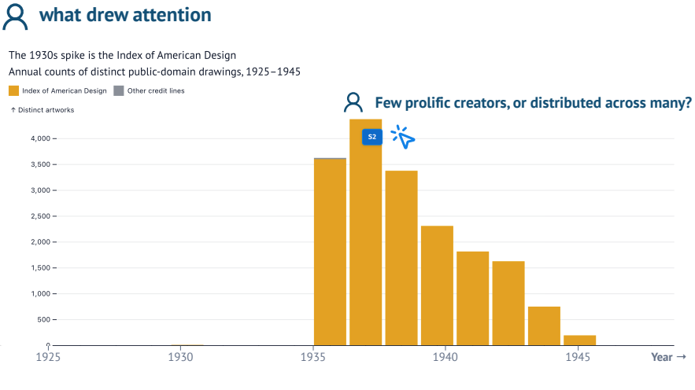

# What is Lens?

**Let your agent see what you see.**

Lens is a widget for [marimo](https://marimo.io/), a reactive Python notebook.
It lets you point at part of a rendered result, such as a bar in a chart or a
row in a table, and hand that mark to a notebook agent together with the code
and data behind it. The agent inspects, revises, and verifies the notebook.
Lens then brings the result back into view for your review.

[marimo Pair](https://marimo.io/pair) and marimo's code-mode sidebar let people
collaborate with agents on notebook analyses. A person asks in plain language
while the agent inspects data, edits code, and runs cells in the live notebook.
When the question is about something visible, language is a poor pointer. "The
spike in that chart" names neither the cell nor the pixels. The person sees the
result and can point at it. The agent needs the producing cell, its
dependencies, and the values that made it. Lens connects the two.

## Point at what you mean

An analyst explores annual counts of public-domain drawings. The 1937 bar stands
out, so they select it and ask whether a few prolific creators or many creators
caused the spike.



Lens stores the rendered **target**, the **point or region** that drew
attention, and the analyst's **note** as one **selection** with a stable `S<n>`
label. The chart, the marked bar, and the question preserve what the analyst
means. Lens calls this **visual grounding**.

## Ground it in the notebook

A mark tells the agent where the person looked, not which data and
transformations produced what they see. marimo records how variables flow
between cells as a
[dataflow graph](https://docs.marimo.io/guides/editor_features/dataflow/).
Lens follows that graph from the selected output to its producing cell and a
bounded set of relevant upstream cells, and collects their source and current
control values.


Lens calls this **computational grounding**. It gives the agent a focused place
to inspect the live notebook, test the question, and revise the analysis. The
lineage also shows where a change belongs. Feedback on a chart often belongs in
the dataset or an earlier step while the chart code stays unchanged.

When browser capture succeeds, an annotated image of the selected target joins
the selection. Note, code, and image are independent evidence. The selection
stays usable when any one of them is missing.

## Point, revise, review

Visual grounding answers "What does the person mean?" Computational grounding
answers "Where did this result come from?" Lens keeps both on the same
selection through a short loop:

1. **Point and ask.** You mark a point or region and add a note such as
   "Explain this spike."
2. **Revise and verify.** Your agent reads the Lens context, inspects the live
   notebook, and changes what needs to change. Lens marks where the agent is
   working.
3. **Review and continue.** The agent brings the result into view and resolves
   the selection into **History** with a summary. You judge the evidence and
   can reopen the selection for another pass.

Grounding gives the agent a starting point. The agent still interprets the
selected region and verifies its work. You still decide whether the result
answers the question.

Our [Point, Revise, Review](https://arxiv.org/abs/2609.19839) paper follows
this loop through an analysis of the National Gallery of Art's open data.

## Lens and your agent

Lens is a Python package installed in the notebook environment. Mount it in one
cell and keep that cell displayed:

```python
from marimo_lens import Lens

lens = Lens()
lens
```

Lens owns selections, notebook context, and visible feedback. It does not edit
or run cells. That work belongs to a **code-mode agent**, an agent that can
execute Python in the live notebook kernel, such as one connected through
marimo Pair. The `marimo-lens` package includes the agent's own instructions,
so a connected agent reads guidance that matches the installed version.

## Where next

| I want to…                                 | Read                                 |
| ------------------------------------------ | ------------------------------------ |
| Install Lens and make a first selection    | [Getting started](./getting-started) |
| Understand the selection lifecycle         | [How Lens works](./how-lens-works)   |
| Connect or build an agent integration      | [Connect an agent](./agents)         |
| Make a dashboard or custom view selectable | [Custom targets](./custom-targets)   |
| Know what an agent can see                 | [Data and trust](./data-and-trust)   |
