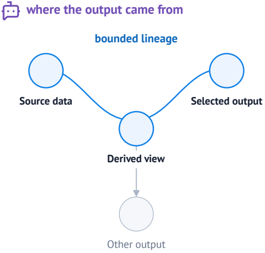

# Why Lens?

A notebook result has two relevant views. A person sees the rendered result and
points to what matters. An agent needs the cells, dependencies, and values that
produced it. Lens connects the visible question to that structured notebook
context.

## A person starts from what they see

An analyst is exploring annual counts of public-domain drawings. The 1937 bar
stands out, so they select it and ask whether the spike comes from a few
prolific creators or is distributed across many.

The chart, selected bar, and question preserve what the analyst means. Lens
calls this **visual grounding**. It records the rendered target, the point or
region that drew attention, and the analyst's note as one selection.

## The agent needs to know how it was made

A marked output tells the agent where the analyst looked, but not which data
and transformations produced what they see. To answer from the notebook's data
and computation, the agent needs a route to the producing cell, its relevant
upstream cells, and the data flowing through them.

That lineage also helps the agent find the right place to change. Feedback
attached to a chart may belong in the backing dataset or an earlier analytical
step, while the chart code remains unchanged.

marimo represents relationships between cells as a
[dataflow graph](https://docs.marimo.io/guides/editor_features/dataflow/), which
records how variables flow from one cell to another. Lens connects the
selection to this graph, identifying the producing cell and a bounded set of
relevant upstream cells.

Lens calls this **computational grounding**. It gives the agent a focused place
to inspect the live notebook, test the analyst's question, and revise the
analysis.

## Connecting attention to computation

Visual grounding answers, “What does the person mean?” Computational grounding
answers, “Where did this result come from?” Lens keeps both with the same
selection, turning a phrase such as “this bar” into a request tied to visible
evidence and notebook computation.

The two forms stay connected through a short collaboration loop:

1. **Point and ask.** The person marks visible evidence and states the question.
2. **Inspect and revise.** The agent follows the relevant notebook context,
   verifies its interpretation, and changes the live notebook when needed.
3. **Review and continue.** Lens brings the result back into view. The person
   judges the evidence and directs the next question.

Grounding gives the agent a starting point. The agent still has to interpret
the selected region and verify its work. The person still decides whether the
result answers the question.

## Continue

- [Getting started](./getting-started) creates the first selection.
- [How Lens works](./how-lens-works) shows the complete collaboration loop.
- [Context and evidence](./concepts/evidence) defines what the agent receives.
- [Feedback and History](./concepts/feedback) explains review and reopening.
